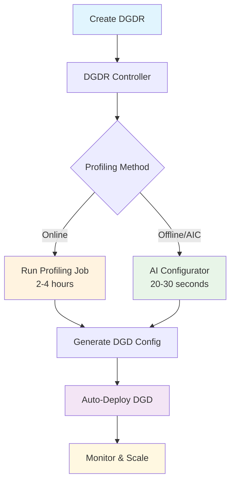
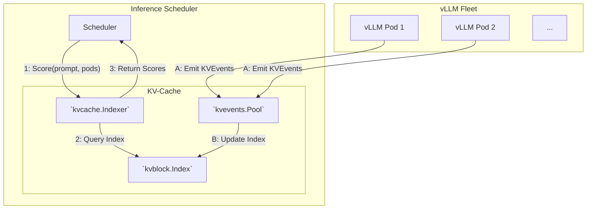
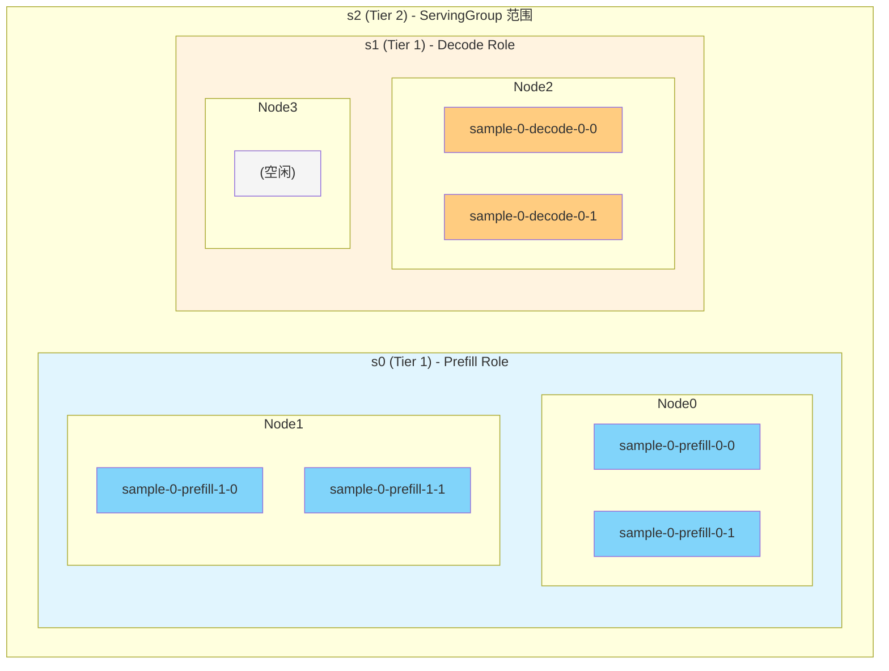

# Inference Platform

## NVIDIA Dynamo

安装 Dynamo 可以参考 [Deploying Dynamo on Kubernetes](https://github.com/ai-dynamo/dynamo/blob/main/docs/kubernetes/README.md)。

### 使用 DynamoGraphDeployment 部署推理服务

```yaml
apiVersion: nvidia.com/v1alpha1
kind: DynamoGraphDeployment
metadata:
  name: vllm-agg
spec:
  services:
    Frontend:
      dynamoNamespace: vllm-agg
      componentType: frontend
      replicas: 1
      extraPodSpec:
        mainContainer:
          image: nvcr.io/nvidia/ai-dynamo/vllm-runtime:0.7.1
    VllmDecodeWorker:
      envFromSecret: hf-token-secret
      dynamoNamespace: vllm-agg
      componentType: worker
      replicas: 1
      resources:
        limits:
          gpu: "1"
      extraPodSpec:
        mainContainer:
          image: nvcr.io/nvidia/ai-dynamo/vllm-runtime:0.7.1
          workingDir: /workspace/examples/backends/vllm
          command:
            - python3
            - -m
            - dynamo.vllm
          args:
            - --model
            - Qwen/Qwen3-0.6B
```

### PD 分离

当 Decode Worker 收到请求后，首先判断 Prefill 应该在本地还是远程执行，并分配 KV Blocks。如果选择远程执行，则将 Remote Prefill 请求推送到 Prefill Queue（基于 NATS）。Prefill Worker 从队列拉取请求，通过 NIXL 从 Decode Worker 读取 Prefix Cache 命中的 KV Blocks，执行 Prefill 计算后，再通过 NIXL 将计算后的 KV Blocks 写回 Decode Worker。最后 Decode Worker 收到完成通知后执行剩余的 Decode。


以下是 PD 分离的 DynamoGraphDeployment 配置示例：

```yaml
apiVersion: nvidia.com/v1alpha1
kind: DynamoGraphDeployment
metadata:
  name: vllm-disagg
spec:
  services:
    Frontend:
      dynamoNamespace: vllm-disagg
      componentType: frontend
      replicas: 1
      extraPodSpec:
        mainContainer:
          image: nvcr.io/nvidia/ai-dynamo/vllm-runtime:0.7.1
    VllmDecodeWorker:
      dynamoNamespace: vllm-disagg
      envFromSecret: hf-token-secret
      componentType: worker
      subComponentType: decode
      replicas: 1
      resources:
        limits:
          gpu: "1"
      extraPodSpec:
        mainContainer:
          image: nvcr.io/nvidia/ai-dynamo/vllm-runtime:0.7.1
          workingDir: /workspace/examples/backends/vllm
          command:
          - python3
          - -m
          - dynamo.vllm
          args:
            - --model
            - Qwen/Qwen3-0.6B
            - --is-decode-worker
    VllmPrefillWorker:
      dynamoNamespace: vllm-disagg
      envFromSecret: hf-token-secret
      componentType: worker
      subComponentType: prefill
      replicas: 1
      resources:
        limits:
          gpu: "1"
      extraPodSpec:
        mainContainer:
          image: nvcr.io/nvidia/ai-dynamo/vllm-runtime:my-tag
          workingDir: /workspace/examples/backends/vllm
          command:
          - python3
          - -m
          - dynamo.vllm
          args:
            - --model
            - Qwen/Qwen3-0.6B
            - --is-prefill-worker
```

### Prefix Cache Aware Routing

Dynamo KV Router 通过评估请求在不同 Worker 上的计算成本来智能路由请求，综合考虑 Decode 成本（来自活跃 Blocks）和 Prefill 成本（来自新计算的 Blocks），在最大化 Prefix Cache 命中率的同时保持负载均衡。


#### 路由计算公式

```
logit = kv_overlap_score_weight × potential_prefill_blocks + potential_active_blocks
```

- **logit**：值越低越好（计算成本越低）
- **potential_prefill_blocks**：需要计算的 Prefill Block 数量（KV Cache 匹配越长，需要计算的越少）
- **potential_active_blocks**：当前正在处理请求的 Block 数量，反映 Worker 负载
- **kv_overlap_score_weight**（默认 1.0）：
  - `> 1.0`：注重 TTFT，优先选择 KV Cache 匹配长的 Worker
  - `< 1.0`：注重 ITL，优先选择负载低的 Worker

#### 路由模式

Prefix Cache Aware Routing 可分为**精确模式**和**近似模式**两种：

1. **精确模式**：Worker 上报 KV 事件，Router 维护准确的全局 Cache 状态
   - **JetStream（默认）**：事件发送到持久化的 NATS JetStream，支持多副本一致性和重启恢复。适用于生产环境。

   

   - **NATS Core + Local Indexer**：Worker 使用 `--enable-local-indexer` 维护本地 Radix Tree，通过 NATS Core 发布事件。适用于低延迟、简单部署。

   

2. **近似模式**（`--no-kv-events`）：禁用 KV 事件追踪。默认情况下（不提供此标志时），Router 使用 KV 事件监控 Worker 的 Block 创建和删除。启用此标志后，Router 将根据路由决策并结合基于 TTL 的过期（默认 120 秒）和修剪来预测缓存状态。如果你的 Backend 不支持 KV 事件（或对事件的准确性或响应性没有信心），请使用此标志。

#### 配置示例

以下是启用 KV Router 的 DynamoGraphDeployment 配置示例：

```yaml
apiVersion: nvidia.com/v1alpha1
kind: DynamoGraphDeployment
metadata:
  name: my-deployment
spec:
  services:
    Frontend:
      dynamoNamespace: my-namespace
      componentType: frontend
      replicas: 1
      envs:
        - name: DYN_ROUTER_MODE
          value: kv  # 启用 KV Cache Aware Routing
        - name: DYN_ROUTER_TEMPERATURE
          value: "0.5"  # 增加随机性防止 Worker 饱和
        - name: DYN_KV_OVERLAP_SCORE_WEIGHT
          value: "1.5"  # 优先 TTFT 而非 ITL
        - name: DYN_KV_CACHE_BLOCK_SIZE
          value: "16"
      extraPodSpec:
        mainContainer:
          image: nvcr.io/nvidia/ai-dynamo/vllm-runtime:0.6.0
```

参考资料：
- [KV Cache Routing](https://github.com/ai-dynamo/dynamo/blob/main/docs/router/kv_cache_routing.md)
- [KV Router Overview](https://github.com/ai-dynamo/dynamo/blob/main/docs/router/README.md)

### SLA Planner

SLA Planner 是 Dynamo 的智能自动扩缩容系统，使用**预测建模**和**性能插值**来主动调整 Prefill 和 Decode Worker 数量，确保推理服务满足指定的 TTFT 和 ITL 目标。

SLA Planner 由以下几个关键组件构成：

1. **Load Predictors**：预测未来的请求模式（请求数量、输入/输出序列长度）
2. **Performance Interpolators**：基于 Profiling 性能数据估算 TTFT 和 ITL
3. **Correction Factors**：根据观测值与预期值的偏差调整预测
4. **Scaling Logic**：计算最优的 Prefill/Decode 副本数以满足 SLA 目标

#### 扩缩容算法

SLA Planner 使用复杂的扩缩容算法。在每个调整间隔，SLA Planner 执行以下操作：

**1. 指标收集**

每个调整间隔收集：
- 平均 Time to First Token (TTFT)
- 平均 Inter-Token Latency (ITL)
- 请求数量和持续时间
- 输入/输出序列长度

**2. 校正因子计算**

使用收集的指标，SLA Planner 应用 Interpolator 找出预期的 TTFT/ITL 并校准插值模型。这一步很重要，因为实际的 TTFT/ITL 通常与理想情况不同：
- **TTFT**：实际 TTFT 严重依赖于请求排队和 Prefix Cache 命中率（如果使用 KV 复用）。例如，如果所有请求都在调整间隔开始时到达，由于当前 Worker 数量是基于上一周期的负载预测的，Planner 还没来得及扩容，请求只能排队等待，TTFT 会显著更高。如果 Prefix Cache 命中率很高，Prefill 中的实际 token 数量会很低，TTFT 会显著更低。
- **ITL**：实际 ITL 可能受 Decode 引擎中 Chunked 小 Prefill 请求的影响。
- **指标方差**：请求率、ISL 和 OSL 的大方差可能导致 TTFT/ITL 估计不准确，因为 SLA 在插值时只考虑平均值。

SLA Planner 计算校正因子：
- **Prefill correction**：`actual_ttft / expected_ttft`
- **Decode correction**：`actual_itl / expected_itl`

**3. 负载预测**

SLA Planner 使用 Load Predictor 预测下一个调整间隔的请求数量、ISL 和 OSL。目前支持三种负载预测模型：

| Predictor | 适用场景 | 行为 | 配置 |
|-----------|----------|------|------|
| **Constant** | 稳定负载和长预测周期 | 假设下一周期负载等于当前负载 | `load-predictor: "constant"` |
| **ARIMA** | 具有趋势和季节性的时间序列数据 | 使用 auto-ARIMA 拟合最优模型参数 | `load-predictor: "arima"` |
| **Prophet** | 复杂的季节性模式和趋势变化 | Facebook 的 [Prophet](https://facebook.github.io/prophet/) 时间序列预测模型 | `load-predictor: "prophet"` |

**4. 计算所需副本数**

**Prefill 副本数**：SLA Planner 假设 Prefill 校正因子对每 GPU 的 Prefill 吞吐量有线性影响，因为 Prefill 是单批处理的。

```
predicted_load = next_requests * next_isl / interval * min(1, prefill_correction)
prefill_replicas = ceil(predicted_load / interpolated_throughput / gpus_per_engine)
```

计算逻辑：
1. `predicted_load`：预测的 Prefill 负载 = 预测请求数 × 预测 ISL / 调整间隔 × 校正因子（上限为 1）
2. `prefill_replicas`：所需副本数 = 预测负载 / 每 GPU 插值吞吐量 / 每实例 GPU 数，向上取整

**Decode 副本数**：与 Prefill 不同，Decode 是显存带宽密集型操作，使用 Continuous Batching 多请求共享 GPU。ITL 受 KV Cache 占用率和 Context Length 双重影响，因此需要通过 2D 插值反向查找满足 ITL 目标的吞吐量，且校正因子应用于 ITL 目标而非负载。

```python
# 1. 将 d_correction_factor 应用到 ITL SLA
corrected_itl = self.args.itl / self.d_correction_factor
# 2. 反向查找在预测的 context length 下能达到 corrected_itl 的最佳吞吐量/GPU
pred_decode_thpt_per_gpu = self.decode_interpolator.find_best_throughput_per_gpu(
    itl=corrected_itl,
    context_length=next_isl + next_osl / 2
)
# 3. 计算所需的 decode 副本数
next_num_d = math.ceil(next_num_req * next_osl / self.args.adjustment_interval / pred_decode_thpt_per_gpu / self.args.decode_engine_num_gpu)
```

计算逻辑：
1. `corrected_itl`：校正后的 ITL 目标 = ITL SLA 目标 / Decode 校正因子（如果实际 ITL 比预期高，校正因子 > 1，则降低 ITL 目标以补偿）
2. `pred_decode_thpt_per_gpu`：通过 Interpolator 反向查找，在预测的平均 context length（ISL + OSL/2）下，能满足校正后 ITL 目标的最大吞吐量/GPU
3. `next_num_d`：所需副本数 = 预测请求数 × 预测 OSL / 调整间隔 / 每 GPU 吞吐量 / 每实例 GPU 数，向上取整

**5. 执行扩缩容**

最后，SLA Planner 通过扩缩容 Prefill 和 Decode Worker 数量到计算出的副本数来应用变更。

#### 使用 DynamoGraphDeploymentRequest 进行 SLA 的性能分析

SLA Planner 要求在部署前完成 Profiling。Profiling 过程分析模型的性能特征，确定最优的并行配置和 Planner 运行时使用的扩缩容参数。

你可以使用 DynamoGraphDeploymentRequest (DGDR) 来部署满足 SLA 优化的 Dynamo DynamoGraphDeploymentRequest 工作流自动化从 SLA 定义到部署的全过程：

1. **定义 SLA**：在 DynamoGraphDeploymentRequest 中指定性能需求（TTFT、ITL）和模型信息。
2. **自动 Profiling**：Dynamo Operator 自动对模型进行性能分析，找到最优配置。
3. **自动部署**：Profiling 完成后，系统自动创建并部署满足 SLA 的 DynamoGraphDeployment（包含最优并行配置和 Planner 组件）和 `planner-profile-data` ConfigMap（性能插值数据）。

DynamoGraphDeploymentRequest 支持两种性能分析方式：
- **Online Profiling (AIPerf)**：在 Kubernetes 中部署真实推理实例进行性能分析，耗时 2-4 小时，精度最高，支持 vLLM、SGLang、TensorRT-LLM。
- **Offline Profiling (AI Configurator)**：使用性能模拟器快速估算，仅需 20-30 秒，目前仅支持 TensorRT-LLM。



##### 在线性能分析

通过在 Kubernetes 中创建真实的测试部署并测量性能。耗时 2-4 小时，精度最高，支持 vLLM、SGLang、TensorRT-LLM。

```yaml
apiVersion: nvidia.com/v1alpha1
kind: DynamoGraphDeploymentRequest
metadata:
  name: vllm-dense-online
spec:
  model: "Qwen/Qwen3-0.6B"        # 模型名称
  backend: vllm                    # 推理后端：vllm / sglang / trtllm

  profilingConfig:
    profilerImage: "nvcr.io/nvidia/ai-dynamo/vllm-runtime:0.7.1"  # Profiling 使用的镜像
    config:
      sla:                         # SLA 
        isl: 3000                  # 输入序列长度
        osl: 150                   # 输出序列长度
        ttft: 200.0                # 首 Token 延迟目标 (ms)
        itl: 20.0                  # Token 间延迟目标 (ms)

      hardware:                    # 硬件配置
        min_num_gpus_per_engine: 2      # 每实例最小 GPU 数（未指定时根据模型和显存自动确定）
        max_num_gpus_per_engine: 8      # 每实例最大 GPU 数
        num_gpus_per_node: 8            # 每节点 GPU 数（用于多节点 MoE）
        gpu_type: h200_sxm              # GPU 类型

      sweep:
        use_ai_configurator: false # 在线性能分析

  deploymentOverrides:
    workersImage: "nvcr.io/nvidia/ai-dynamo/vllm-runtime:0.7.1"  # 部署时使用的镜像

  autoApply: true                  # Profiling 完成后自动部署 DynamoGraphDeployment
```

##### 使用 AI Configurator 离线模拟分析

使用性能模拟快速估算最优配置，无需运行真实部署。耗时仅 20-30 秒，目前仅支持 TensorRT-LLM。

```yaml
apiVersion: nvidia.com/v1alpha1
kind: DynamoGraphDeploymentRequest
metadata:
  name: trtllm-aic-offline
spec:
  model: "Qwen/Qwen3-32B"
  backend: trtllm

  profilingConfig:
    profilerImage: "nvcr.io/nvidia/ai-dynamo/tensorrtllm-runtime:0.6.1"
    config:
      sla:
        isl: 4000
        osl: 500
        ttft: 300.0
        itl: 10.0

      sweep:
        use_ai_configurator: true # 使用 AI Configurator 离线模拟

      aic:
        system: h200_sxm
        model_name: QWEN3_32B
        backend_version: "0.20.0"

  deploymentOverrides:
    workersImage: "nvcr.io/nvidia/ai-dynamo/tensorrtllm-runtime:0.6.1"

  autoApply: true
```

参考资料：

- [SLA-Driven Profiling and Planner Deployment Quick Start Guide](https://github.com/ai-dynamo/dynamo/blob/v0.7.1/docs/planner/sla_planner_quickstart.md)
- [SLA-Driven Profiling with DynamoGraphDeploymentRequest](https://github.com/ai-dynamo/dynamo/blob/v0.7.1/docs/benchmarks/sla_driven_profiling.md)
- [SLA-based Planner](https://github.com/ai-dynamo/dynamo/blob/v0.7.1/docs/planner/sla_planner.md)

### KVBM (KV Block Manager)

Dynamo KV Block Manager (KVBM) 是一个可扩展的运行时组件，用于处理跨异构和分布式环境的推理任务中 Key-Value (KV) Block 的内存分配、管理和远程共享。它作为 vLLM、SGLang 和 TRT-LLM 等框架的统一内存层。KVBM 提供：

- **统一内存 API**：跨 GPU 显存（未来）、锁页主机内存、RDMA 可访问远程内存、本地/分布式 SSD 池和远程文件/对象/云存储系统。
- **Block 生命周期管理**：支持 allocate → register → match 的状态转换，存储后端可订阅基于事件的状态变化。
- **NIXL 集成**：通过 RDMA/NVLink 进行远程内存块的注册、共享和访问。


#### KVBM 内存层级

KVBM 跨多个内存层级协调 KV Block：GPU 显存 (G1)、本地/跨节点 CPU 内存 (G2)、本地/池化 SSD (G3) 和远程存储 (G4)。需要注意的是，KVBM 将 G4 存储视为不透明的 Blob 存储，不感知其内部布局优化。


#### KV Cache Offloading 场景

当 KV Cache 超出 GPU 显存且缓存复用收益大于数据传输开销时，将 KV Cache Offload 到 CPU 或存储最为有效。在长上下文、高并发或资源受限的推理环境中尤其有价值：

- **长会话和多轮对话**：Offloading 保留大型 Prompt 前缀，避免重计算，改善首 Token 延迟和吞吐量。
- **高并发（未来）**：空闲或部分会话可移出 GPU 显存，让活跃请求继续处理而不触及内存限制。
- **共享或重复内容（未来）**：跨用户/会话复用（如系统 Prompt 和模板）提高缓存命中率，尤其在远程或跨实例共享场景。
- **内存或成本受限部署**：Offloading 到 RAM 或 SSD 降低 GPU 需求，允许更长的 Prompt 或更多用户而无需增加硬件。

#### 使用 KVBM

```yaml
apiVersion: nvidia.com/v1alpha1
kind: DynamoGraphDeployment
metadata:
  name: vllm-disagg-kvbm
spec:
  services:
    Frontend:
      dynamoNamespace: vllm-disagg-kvbm
      componentType: frontend
      replicas: 1
      extraPodSpec:
        mainContainer:
          image: nvcr.io/nvidia/ai-dynamo/vllm-runtime:0.7.1
    VllmDecodeWorker:                          # Decode Worker 不需要 KVBM
      dynamoNamespace: vllm-disagg-kvbm
      envFromSecret: hf-token-secret
      componentType: worker
      replicas: 1
      resources:
        limits:
          gpu: "1"
      extraPodSpec:
        mainContainer:
          image: nvcr.io/nvidia/ai-dynamo/vllm-runtime:0.7.1
          workingDir: /workspace/examples/backends/vllm
          command:
          - python3
          - -m
          - dynamo.vllm
          args:
            - --model
            - Qwen/Qwen3-8B
            - --max-model-len
            - "32000"
            - --enforce-eager
    VllmPrefillWorker:                         # Prefill Worker 启用 KVBM
      dynamoNamespace: vllm-disagg-kvbm
      envFromSecret: hf-token-secret
      componentType: worker
      replicas: 1
      resources:
        requests:
          gpu: "1"
          memory: "200Gi"                      # KVBM 需要大量 CPU 内存
        limits:
          gpu: "1"
          memory: "250Gi"
      envs:
        - name: DYN_KVBM_CPU_CACHE_GB          # 配置 CPU 缓存大小
          value: "100"                         # 100GB CPU 内存用于 KV Cache
      extraPodSpec:
        mainContainer:
          image: nvcr.io/nvidia/ai-dynamo/vllm-runtime:0.7.1
          workingDir: /workspace/examples/backends/vllm
          command:
          - python3
          - -m
          - dynamo.vllm
          args:
            - --model
            - Qwen/Qwen3-8B
            - --is-prefill-worker
            - --max-model-len
            - "32000"
            - --enforce-eager
            - --connector
            - kvbm                             # 启用 KVBM connector
            - nixl                             # P/D 分离需要 NIXL 传输
```

参考资料：

- [KV Block Manager](https://github.com/ai-dynamo/dynamo/blob/main/docs/kvbm/kvbm_intro.rst)
- [Motivation behind KVBM](https://github.com/ai-dynamo/dynamo/blob/main/docs/kvbm/kvbm_motivation.md)

### NIXL (NVIDIA Inference tranXfer Library)

高性能 P/D 分离的关键是高效的 KV 传输。Dynamo 利用 NIXL 将 KV Cache 直接从 Prefill 实例的显存传输到 Decode 实例的显存。此外，KV 传输是非阻塞的，允许 GPU 在 KV 传输的同时继续执行其他请求的前向传播。


#### NIXL 支持的后端

NIXL 支持多种后端：

- 块存储（GPU HBM、Host DRAM、Remote DRAM、Local SSD）
- 本地文件系统（POSIX）
- 远程文件系统（NFS）
- 对象存储（S3 兼容）
- 云存储（Blob Storage API）

#### 元数据优化

为了减少内存描述符的大小，Dynamo 采用了两项优化：

1. **ETCD 元数据存储**：每个 Worker 完成初始化并分配所有 KV Cache 池后，将所有 Block 的内存描述符（也称为 NIXL 元数据）存储到 ETCD（分布式键值存储）中。Prefill Worker 在首次处理某个 Worker 发起的远程 Prefill 请求时，加载并缓存该 Worker 的内存描述符。因此，发起远程 Prefill 请求时只需传递 KV Block ID，而非完整的内存描述符。

2. **连续块合并**：Dynamo 优化 Prefill 实例中的内存分配器，分配连续的块并将连续块合并为更大的块，以减少 KV Block 的总数。

#### KV 布局转置

对于使用不同 TP 配置的 Decode 和 Prefill，KV 布局会不同。Dynamo 在 NIXL 读取之后、写入之前，使用高性能 kernel 将 KV Block 转置为接收方匹配的布局。

参考资料：

- [NIXL GitHub](https://github.com/ai-dynamo/nixl)
- [Dynamo Disaggregation: Separating Prefill and Decode for Enhanced Performance](https://github.com/ai-dynamo/dynamo/blob/main/docs/design_docs/disagg_serving.md)
- [KVBM components](https://github.com/ai-dynamo/dynamo/blob/main/docs/kvbm/kvbm_design_deepdive.md)

### Fault Tolerance（容错机制）

Dynamo 的容错机制包含两个核心部分：**Request Migration（请求迁移）** 和 **Request Cancellation（请求取消）**。

#### Request Migration（请求迁移）

Request Migration 允许正在进行的请求在原始 Worker 不可用时迁移到其他 Worker 继续执行，实现故障容错和无缝用户体验。


**两种迁移场景**：

1. **New Request Migration（初始连接失败）**：Worker 在建立初始连接时不可达，系统检测到连接失败后递减重试计数，使用原始请求尝试连接其他 Worker。由于生成尚未开始，无需保存部分状态。

2. **Ongoing Request Migration（中途断连）**：生成过程中连接断开。系统检测到 Stream 终止后，保留已累积的 token 序列（包含原始 prompt 和已生成的所有 token），使用累积状态在新 Worker 上重建 Stream，从断点继续生成。

**配置**：使用 `--migration-limit` 参数指定最大迁移次数（默认为 0，即禁用迁移）。

#### Request Cancellation（请求取消）

Request Cancellation 允许取消正在进行的请求，节省计算资源。使用 HTTP 接口时，如果客户端断开连接，Dynamo 会自动取消发送给 Worker 的下游请求，确保计算资源不会浪费在不再需要的响应生成上。


参考资料：

- [Request Migration Architecture](https://github.com/ai-dynamo/dynamo/blob/main/docs/fault_tolerance/request_migration.md)
- [Request Cancellation Architecture](https://github.com/ai-dynamo/dynamo/blob/main/docs/fault_tolerance/request_cancellation.md)
- [Inference Office Hours: Building Fault Tolerance in Systems of Scale for LLM inference](https://www.youtube.com/watch?v=_P-JY65_W78)

### 多节点部署

多节点部署允许将计算密集型 LLM 工作负载扩展到多台物理机器上，最大化 GPU 利用率并支持更大的模型。

#### 多节点编排方案

Dynamo 支持两种多节点编排方案：

1. **Grove + KAI-Scheduler（默认）**
   - [Grove](https://github.com/NVIDIA/grove)：Grove 提供单一声明式接口编排 AI 推理工作负载，从简单单 Pod 部署到复杂多节点 P/D 分离系统。Grove 支持从单副本扩展到数据中心规模（数万 GPU），提供多级自动扩缩容和显式启动顺序。
   - [KAI-Scheduler](https://github.com/NVIDIA/KAI-Scheduler)：KAI-Scheduler 是一个强大、高效且可扩展的 Kubernetes 调度器，旨在为 AI 和机器学习工作负载优化 GPU 资源分配。KAI-Scheduler 支持 Gang 调度、拓扑感知放置，管理大规模 GPU 集群（数千节点），在确保不同使用者之间资源公平性的同时实现资源的最佳分配。


2. **LWS + Volcano**
   - [LWS](https://github.com/kubernetes-sigs/lws)：简单的多节点部署机制，允许跨多个节点部署工作负载
   - [Volcano](https://volcano.sh/)：针对 AI 工作负载优化的 Kubernetes 原生调度器，与 LWS 配合提供 Gang 调度支持

当两者都可用时，Grove 默认被选中（推荐用于高级 AI 工作负载）。可通过 `nvidia.com/enable-grove: "false"` 注解强制使用 LWS。

#### DynamoGraphDeployment 配置

通过 `multinode` 字段配置多节点部署：

```yaml
apiVersion: nvidia.com/v1alpha1
kind: DynamoGraphDeployment
metadata:
  name: my-multinode-deployment
spec:
  services:
    my-service:
      multinode:             # 多节点配置
        nodeCount: 2         # 节点数量
      resources:
        limits:
          gpu: "4"           # 每节点 GPU 数量
      extraPodSpec:
        mainContainer:
          args:
            - "--tp-size"
            - "8"            # 必须等于 nodeCount × gpu
```

**GPU 分配关系**：`总 GPU 数 = multinode.nodeCount × gpu`

#### 自动注入分布式参数

Dynamo Operator 会根据 Backend 自动注入分布式执行参数：

**vLLM（使用 Ray）**：
- Leader 节点：`ray start --head --port=6379 && <vllm-command> --distributed-executor-backend ray`
- Worker 节点：`ray start --address=<leader-hostname>:6379 --block`

**SGLang**：
- 自动注入：`--dist-init-addr <leader-hostname>:29500 --nnodes <count> --node-rank <rank>`

**TensorRT-LLM（使用 MPI）**：
- 自动配置 SSH 密钥和 `mpirun` 命令

参考资料：
- [Multinode Deployment Guide](https://github.com/ai-dynamo/dynamo/blob/main/docs/kubernetes/deployment/multinode-deployment.md)

### 模型管理

Dynamo 通过 `DynamoModel` CRD 实现动态模型管理，主要用于在运行中的推理服务上动态加载/卸载 LoRA Adapter，无需重启 Pod。

#### 工作流程

创建 DynamoModel 时，Dynamo Operator 会执行以下操作：

1. **发现端点**：通过匹配 DynamoGraphDeployment 中的 `modelRef.name` 找到所有运行 `baseModelName` 的 Pod。
2. **创建 Service**：自动创建 Kubernetes Service 来追踪这些 Pod。
3. **加载 LoRA**：对每个端点调用 LoRA 加载 API（仅 `lora` 类型）。
4. **更新状态**：报告哪些端点已就绪。

#### 配置示例

```yaml
# 1. 部署基础模型
apiVersion: nvidia.com/v1alpha1
kind: DynamoGraphDeployment
metadata:
  name: my-deployment
spec:
  services:
    Worker:
      modelRef:
        name: Qwen/Qwen3-0.6B       # 关联 DynamoModel
      componentType: worker
      replicas: 2
      resources:
        limits:
          gpu: "1"
      extraPodSpec:
        mainContainer:
          image: nvcr.io/nvidia/ai-dynamo/vllm-runtime:0.7.1
          args:
            - --model
            - Qwen/Qwen3-0.6B
            - --enable-lora          # 启用 LoRA
            - --max-lora-rank
            - "64"
---
# 2. 部署 LoRA Adapter
apiVersion: nvidia.com/v1alpha1
kind: DynamoModel
metadata:
  name: my-lora
spec:
  modelName: my-custom-lora          # LoRA 模型标识符
  baseModelName: Qwen/Qwen3-0.6B     # 必须匹配 DGD 中的 modelRef.name
  modelType: lora
  source:
    uri: s3://my-bucket/loras/my-lora  # 支持 s3:// 或 hf://
```

#### 多 LoRA 场景

同一基础模型可加载多个 LoRA Adapter：

```yaml
# LoRA 1: 客服场景
apiVersion: nvidia.com/v1alpha1
kind: DynamoModel
metadata:
  name: support-lora
spec:
  modelName: support-adapter
  baseModelName: Qwen/Qwen3-0.6B
  modelType: lora
  source:
    uri: s3://models/support-lora
---
# LoRA 2: 代码场景
apiVersion: nvidia.com/v1alpha1
kind: DynamoModel
metadata:
  name: code-lora
spec:
  modelName: code-adapter
  baseModelName: Qwen/Qwen3-0.6B    # 同一基础模型
  modelType: lora
  source:
    uri: s3://models/code-lora
```

请求时通过 `model` 字段指定使用哪个 LoRA：

```bash
curl -X POST http://localhost:8000/v1/completions \
  -d '{"model": "support-adapter", "prompt": "Hello"}'
```

参考资料：
- [Managing Models with DynamoModel](https://github.com/ai-dynamo/dynamo/blob/main/docs/kubernetes/deployment/dynamomodel-guide.md)

## llm-d

llm-d 是一个可扩展的架构，旨在跨模型服务 Pod 高效路由推理请求。该架构的核心组件是 Inference Gateway，它基于 Kubernetes 原生的 Gateway API Inference Extension 构建，实现可扩展、灵活且可插拔的请求路由。

### Inference Scheduler

[Inference Scheduler](https://github.com/llm-d/llm-d-inference-scheduler) 为 llm-d 推理框架提供 Endpoint Picker (EPP) 组件，为推理请求做出优化的路由决策。

EPP 扩展了 [Gateway API Inference Extension (GIE)](https://gateway-api-inference-extension.sigs.k8s.io/) 项目，该项目提供调度所需的 API 资源和机制。llm-d 在此基础上添加了特定功能，如 P/D 分离。两个项目紧密协作，llm-d 中的功能通常需要在 GIE 代码库中进行支持和扩展。独特的实验性功能可能先在 llm-d 中实现，随着时间推移迁移到 GIE。

#### EPP 配置示例

EPP 配置主要由 `plugins` 和 `schedulingProfiles` 组成：
- **plugins**：定义可用的插件实例及其参数。
- **schedulingProfiles**：定义调度配置文件，指定请求处理时使用哪些插件。

路由决策通过可插拔组件实现：
- **Filter**：根据条件排除 Pod（如 `decode-filter` 仅保留 Decode 角色的 Pod）。
- **Scorer**：为候选 Pod 评分（如 `prefix-cache-scorer` 基于 KV Cache 命中率评分），通过 `weight` 指定权重。

```yaml
apiVersion: inference.networking.x-k8s.io/v1alpha1
kind: EndpointPickerConfig
plugins:
- type: prefix-cache-scorer
  parameters:
    hashBlockSize: 5
    maxPrefixBlocksToMatch: 256
    lruCapacityPerServer: 31250
- type: decode-filter
- type: max-score-picker
- type: single-profile-handler
schedulingProfiles:
- name: default
  plugins:
  - pluginRef: decode-filter
  - pluginRef: max-score-picker
  - pluginRef: prefix-cache-scorer
    weight: 50
```

#### 请求流程

一次请求的流程如下：

- Client 发送请求（如 `/v1/completions`）到 Gateway（Envoy）。
- Gateway 匹配 HTTPRoute 并选择对应的 InferencePool。
- Gateway 通过 ext-proc 询问 EPP 应该路由到哪个 Pod，EPP 内部执行 Filter → Score → Pick 流程。
- EPP 返回选中的 Pod。
- Gateway 将请求转发到选中的 Pod。

EPP 会周期性地从 InferencePool 中的 Pod 抓取 metrics，用于评分决策。


### KV-Cache Indexer

[KV-Cache Indexer](https://github.com/llm-d/llm-d-kv-cache) 是一个高性能库，用于维护跨多个 vLLM Pod 的 KV-Cache Block 位置的全局近实时视图。其目的是通过提供基于缓存 KV-Blocks 的快速智能评分机制，实现对 vLLM Pod 的智能路由和调度。

Indexer 由 vLLM 流式传输的 KV Event 驱动——当 KV Block 在 vLLM 实例中创建或驱逐时，会发出结构化元数据事件。Indexer 据此追踪每个 Block 所在的节点和存储层（GPU/CPU），为 KV Cache 感知的路由决策提供依据。



### PD 分离

请求流程如下：
1. Client 发送推理请求到 Gateway (Envoy)。
2. Gateway 将请求转发给 EPP 调度器进行端点选择。
3. EPP 执行两阶段调度：
   - 首先，使用 decode profile 选择一个 Decode Pod。
   - 然后，根据 prompt 长度、prefix cache 命中率和 pdThreshold 判断是否需要 Prefill Pod。
   - 如果需要，运行 prefill profile 选择 Prefill Pod。
4. EPP 仅将 Decode Pod 的端点返回给 Gateway，但通过 `prefill-header-handler` 插件将 Prefill Pod 地址（如已选择）注入 HTTP header `x-prefiller-host-port`。
5. Gateway 将请求转发到 Decode Pod 的 sidecar。
6. Sidecar 检查 `x-prefiller-host-port` header：
   - 如果存在，先联系 Prefill Pod 执行 prefill（设置 `max_output_tokens=1`）并获取 KV cache 信息。
   - 然后将包含 prefill 结果的完整请求转发到本地 Decode Pod。
7. Decode Pod 生成最终响应，通过 sidecar → gateway → client 返回。


P/D 分离的 EPP 配置示例如下：

```yaml
apiVersion: inference.networking.x-k8s.io/v1alpha1
kind: EndpointPickerConfig
plugins:
- type: prefill-header-handler        # 注入 x-prefiller-host-port header
- type: prefix-cache-scorer
  parameters:
    hashBlockSize: 5
    maxPrefixBlocksToMatch: 256
    lruCapacityPerServer: 31250
- type: prefill-filter                # Prefill 角色过滤器
- type: decode-filter                 # Decode 角色过滤器
- type: max-score-picker
- type: pd-profile-handler            # P/D 配置文件处理器
  parameters:
    threshold: 10                     # pdThreshold，决定是否需要 Prefill
    hashBlockSize: 5
schedulingProfiles:
- name: prefill                       # prefill-profile
  plugins:
  - pluginRef: prefill-filter         # 仅保留 Prefill 角色的 Pod
  - pluginRef: max-score-picker
  - pluginRef: prefix-cache-scorer
    weight: 50
- name: decode                        # decode-profile
  plugins:
  - pluginRef: decode-filter          # 仅保留 Decode 角色的 Pod
  - pluginRef: max-score-picker
  - pluginRef: prefix-cache-scorer
    weight: 50
```

P/D 分离的组件关系如下图所示：


### vLLM Simulator

[vLLM Simulator](https://github.com/llm-d/llm-d-inference-sim) 是一个轻量级 vLLM 模拟器，用于在无需真实 GPU 资源的情况下模拟 vLLM 实例。

**核心功能**：
- **API 兼容**：实现 `/v1/completions`、`/v1/chat/completions`、`/v1/models` 端点。
- **Prometheus Metrics**：通过 `/metrics` 端点暴露 vLLM 兼容的指标，包括 `vllm:num_requests_running`、`vllm:e2e_request_latency_seconds`、`vllm:time_to_first_token_seconds` 等。
- **响应模式**：
  - Echo 模式：响应返回请求中的相同文本，对于 `/v1/chat/completions` 使用最后一条 `role=user` 的消息。
  - Random 模式：从预定义的句子集合中随机选择响应。
- **LoRA 支持**：可模拟 LoRA 适配器的加载/卸载。
- **P/D 分离**：支持 P/D 分离部署模拟。

**使用场景**：
- 开发和测试 LLM 推理基础设施。
- 在 Kind 等环境中进行 Kubernetes 部署测试。

## Kthena

### 网络拓扑感知调度

在分布式 AI 推理中，节点间的通信延迟直接影响推理效率。通过感知网络拓扑，可以将频繁通信的任务调度到网络距离较近的节点上，从而显著降低通信开销。由于不同网络链路的带宽各异，高效的任务调度能够避免网络拥塞，充分利用高带宽链路，提升整体数据传输效率。

Kthena 利用 Volcano 实现网络拓扑感知调度。为了屏蔽数据中心网络类型的差异，Volcano 定义了一个新的 CRD `HyperNode` 来表示网络拓扑，提供标准化的 API 接口。`HyperNode` 代表一个网络拓扑性能域，通常映射到交换机或 TOR。多个 `HyperNode` 以层级方式连接形成树状结构：


在这个结构中，节点间的通信效率取决于它们之间跨越的 `HyperNode` 层级。例如：
- node0 和 node1 属于 s0，通信效率最高。
- node1 和 node2 需要跨越两层 `HyperNode`（s0→s2→s1），通信效率较低。

其中 `Tier` 表示 `HyperNode` 的层级，层级越低，`HyperNode` 内节点间的通信效率越高。以下是一个 `HyperNode` 配置示例：

```yaml
apiVersion: topology.volcano.sh/v1alpha1
kind: HyperNode
metadata:
  name: s0
spec:
  tier: 1                          # s0 位于 Tier 1
  members:
    - type: Node                   # 成员类型为 Node
      selector:                    # 假设 Node 有 name: <node-name> 的 label
        exactMatch:
          name: node0
    - type: Node
      selector:
        exactMatch:
          name: node1
---
apiVersion: topology.volcano.sh/v1alpha1
kind: HyperNode
metadata:
  name: s1
spec:
  tier: 1                          # s1 位于 Tier 1
  members:
    - type: Node
      selector:
        exactMatch:
          name: node2
    - type: Node
      selector:
        exactMatch:
          name: node3
---
apiVersion: topology.volcano.sh/v1alpha1
kind: HyperNode
metadata:
  name: s2
spec:
  tier: 2                          # s2 位于 Tier 2
  members:
    - type: HyperNode              # 成员类型为 HyperNode
      selector:
        exactMatch:
          name: s0                 # 引用下层的 HyperNode s0
    - type: HyperNode
      selector:
        exactMatch:
          name: s1                 # 引用下层的 HyperNode s1
```

更多关于 `HyperNode` CRD 的细节请参考 [Volcano Network Topology Aware Scheduling](https://volcano.sh/en/docs/network_topology_aware_scheduling/)。

Kthena 的 `ModelServing` 提供了 `networkTopology` 字段来配置 ServingGroup 级别和 Role 级别的网络拓扑约束。下面配置表示整个 ServingGroup 的 Pod 允许跨越 Tier 2 的 HyperNode（s2），即可以分布在 s0 和 s1 之间；而同一 Role 内的 Pod 只能在 Tier 1 的 HyperNode 内（必须在同一个 s0 或 s1 内）。

```yaml
apiVersion: workload.serving.volcano.sh/v1alpha1
kind: ModelServing
metadata:
  name: sample
  namespace: default
spec:
  schedulerName: volcano
  replicas: 1  # servingGroup replicas
  template:
    networkTopology:
      groupPolicy:        # ServingGroup 级别的网络拓扑
        mode: hard
        highestTierAllowed: 2
      rolePolicy:         # Role 级别的网络拓扑
        mode: hard
        highestTierAllowed: 1
    roles:
      - name: prefill
        replicas: 2
        # ......
      - name: decode
        replicas: 1
        # ......
```

Kthena 中 ModelServing、ServingGroup、Role 和 Pod 的层级关系如下：

```
ModelServing: sample
├── ServingGroup: sample-0 (replicas 中的第 1 个)
│   ├── Prefill Role
│   │   ├── prefill-0: sample-0-prefill-0-0, sample-0-prefill-0-1
│   │   └── prefill-1: sample-0-prefill-1-0, sample-0-prefill-1-1
│   └── Decode Role
│       └── decode-0: sample-0-decode-0-0, sample-0-decode-0-1
│
├── ServingGroup: sample-1 (如果 replicas=2)
│   ├── Prefill Role
│   │   └── ...
│   └── Decode Role
│       └── ...
```

基于上述网络拓扑和 ModelServing 配置，Pod 可能的调度情况如下。这个调度结果体现了 `groupPolicy` 和 `rolePolicy` 的区别：
- **rolePolicy (Tier 1)**：同一 Role 的所有 Pod 必须在同一个 Tier 1 HyperNode 内，因此 Prefill 的 4 个 Pod 都在 s0，Decode 的 2 个 Pod 都在 s1。
- **groupPolicy (Tier 2)**：不同 Role 可以分布在不同的 Tier 1 HyperNode，只要都在 Tier 2 范围内，因此 Prefill 在 s0、Decode 在 s1 是允许的。



- `groupPolicy.highestTierAllowed: 2`：整个 ServingGroup 的所有 Pod 可以分布在 s2 内的不同 Tier 1 HyperNode（s0 和 s1）中。
- `rolePolicy.highestTierAllowed: 1`：同一 Role 的所有 Pod 必须在同一个 Tier 1 HyperNode 内。因此 prefill 的所有 Pod 都在 s0 内，decode 的所有 Pod 都在 s1 内。

**关键字段说明**：

- `groupPolicy`：ServingGroup 级别的网络拓扑约束，约束整个 ServingGroup 内所有 Pod 的网络拓扑距离。
- `rolePolicy`：Role 级别的网络拓扑约束，约束同一 Role 内所有 Pod 的网络拓扑距离。
- `mode`：调度模式。
  - `hard`：硬约束，作业内的任务必须部署在同一 HyperNode 内。
  - `soft`：软约束，尽可能将任务部署在同一 HyperNode 内。
- `highestTierAllowed`：与 `hard` 模式配合使用，表示作业部署允许的最高 HyperNode 层级。

**更多 Kthena 网络拓扑细节参考**：https://kthena.volcano.sh/docs/user-guide/network-topology

### Autoscaler

Kthena Autoscaler 根据实时负载动态调整推理实例数量，在维护健康的业务指标（如 SLO）的同时优化计算资源消耗。Autoscaler 通过两个 CRD 进行配置：

- **AutoscalingPolicy**：定义核心扩缩容策略、指标和行为参数。
- **AutoscalingPolicyBinding**：将策略绑定到目标资源并指定扩缩容的副本数边界。

Kthena Autoscaler 提供两种扩缩容粒度：**同构实例扩缩容** 和 **异构实例扩缩容**。

#### 同构实例扩缩容（Homogeneous）

针对单一类型推理实例的扩缩容，类似于 Knative 的 KPA，支持 `Stable` 和 `Panic` 两种模式：

```yaml
apiVersion: workload.serving.volcano.sh/v1alpha1
kind: AutoscalingPolicy
metadata:
  name: scaling-policy
spec:
  metrics:
  - metricName: kthena:num_requests_waiting   # 监控指标
    targetValue: 10.0                          # 目标值
  tolerancePercent: 10                         # 容忍度，防止频繁扩缩容
  behavior:
    scaleUp:
      panicPolicy:                             # Panic 模式：流量突增时快速扩容
        panicThresholdPercent: 150             # 超过目标值 150% 时触发
        panicModeHold: 5m
      stablePolicy:                            # Stable 模式：稳定扩容
        stabilizationWindow: 1m
        period: 30s
    scaleDown:
      stabilizationWindow: 5m                  # 缩容稳定窗口，避免过早缩容
      period: 1m
---
apiVersion: workload.serving.volcano.sh/v1alpha1
kind: AutoscalingPolicyBinding
metadata:
  name: scaling-binding
spec:
  policyRef:
    name: scaling-policy
  homogeneousTarget:
    target:
      targetRef:
        kind: ModelServing
        name: example-model-serving
    minReplicas: 2
    maxReplicas: 10
```

#### 异构实例扩缩容（Heterogeneous）

对于同一模型，推理实例可以部署在多种配置上：
- 异构资源类型（GPU/NPU）
- 不同推理引擎（vLLM/SGLang）
- 不同运行时参数（如 TP/DP 配置）

这些不同部署的实例提供相同的推理服务，但在硬件资源需求和性能上有所不同。使用异构扩缩容时，需要为每种配置分别创建一个 ModelServing（如 `gpu-serving-instance` 和 `cpu-serving-instance`），然后通过 `AutoscalingPolicyBinding` 的 `heterogeneousTarget` 将它们绑定到同一个扩缩容策略。Autoscaler 通过成本优化算法，在满足性能需求的同时最小化资源成本：

```yaml
apiVersion: workload.serving.volcano.sh/v1alpha1
kind: AutoscalingPolicyBinding
metadata:
  name: optimizer-binding
spec:
  policyRef:
    name: optimizer-policy
  heterogeneousTarget:
    costExpansionRatePercent: 20               # 成本扩展率
    params:
    - target:
        targetRef:
          kind: ModelServing
          name: gpu-serving-instance           # GPU 实例
      minReplicas: 1
      maxReplicas: 5
      cost: 100                                # 成本权重
    - target:
        targetRef:
          kind: ModelServing
          name: cpu-serving-instance           # CPU 实例
      minReplicas: 2
      maxReplicas: 8
      cost: 30                                 # 成本更低
```

#### Role 级别扩缩容

对于 P/D 分离场景，可以针对特定 Role（如 Prefill 或 Decode）独立配置扩缩容策略：

```yaml
apiVersion: workload.serving.volcano.sh/v1alpha1
kind: AutoscalingPolicyBinding
metadata:
  name: role-binding
spec:
  policyRef:
    name: scaling-policy
  homogeneousTarget:
    target:
      targetRef:
        kind: ModelServing
        name: example-model-serving
      subTargets:
        kind: Role
        name: prefill                          # 仅针对 prefill role 扩缩容
    minReplicas: 1
    maxReplicas: 5
```

参考资料：

- [Autoscaler User Guide](https://kthena.volcano.sh/docs/user-guide/autoscaler)
- [Autoscaler Architecture](https://kthena.volcano.sh/docs/architecture/autoscaler)

## RoleBasedGroup

[RoleBasedGroup (RBG)](https://github.com/sgl-project/rbg/) 用于编排分布式、有状态的 AI 推理工作负载，支持**多角色协同**和**内置服务发现**。它为生产环境中的大语言模型推理（尤其是解耦架构，如 Prefill/Decode 分离场景）提供了通用的部署范式。

### Instance 和 InstanceSet

RoleBasedGroup 支持为每个 Role 指定不同的底层 workload 类型，默认使用 **StatefulSet**，也可以指定 **Deployment**、**LeaderWorkerSet** 或 **InstanceSet**。

**InstanceSet** 是 RBG 引入的新 workload 类型，管理多个 Instance 副本，支持**原地更新**和滚动更新。每个 **Instance** 是一个逻辑推理实例，可以包含多个 Pod（如 leader + worker），这些 Pod 的生命周期同步（Gang Scheduling、同步启停、一个 Pod 失败时整个 Instance 重启）：

```
InstanceSet: deepseek (replicas: 3)
├── Instance: deepseek-0
│   ├── Pod: deepseek-0-leader-0
│   ├── Pod: deepseek-0-worker-0
│   ├── Pod: deepseek-0-worker-1
│   └── Pod: deepseek-0-worker-2
├── Instance: deepseek-1
│   ├── Pod: deepseek-1-leader-0
│   └── ...
└── Instance: deepseek-2
    └── ...
```

对应的 RoleBasedGroup 配置（使用 `leaderWorkerSet` 配置模式）。注意：这里的 `leaderWorkerSet` 是 **RBG 自己的配置字段**，用于描述 leader-worker 拓扑，而不是使用外部的 LeaderWorkerSet (LWS) workload。实际创建的是 RBG 的 **InstanceSet** 资源：

```yaml
apiVersion: workloads.x-k8s.io/v1alpha1
kind: RoleBasedGroup
metadata:
  name: deepseek
spec:
  roles:
    - name: engine
      replicas: 3                              # 3 个 Instance
      workload:
        apiVersion: workloads.x-k8s.io/v1alpha1
        kind: InstanceSet
      template:                                # 基础模板（Leader 和 Worker 共用）
        spec:
          containers:
            - name: main
              image: vllm/vllm-openai:v0.8.0
              resources:
                limits:
                  nvidia.com/gpu: "8"
      leaderWorkerSet:
        size: 4                                # 每个 Instance 包含 4 个 Pod (1 leader + 3 workers)
        patchLeaderTemplate:                   # Leader 差异化配置（patch 到基础模板）
          spec:
            containers:
              - name: main
                command:
                  - bash
                  - -c
                  - |
                    ray start --head --port=6379
                    python -m vllm.entrypoints.openai.api_server --model=Qwen/Qwen2.5-7B-Instruct --tensor-parallel-size=4
        patchWorkerTemplate:                   # Worker 差异化配置（patch 到基础模板）
          spec:
            containers:
              - name: main
                command:
                  - bash
                  - -c
                  - ray start --address=$(LWS_LEADER_ADDRESS):6379 --block
```

> **为什么使用 `patchLeaderTemplate` / `patchWorkerTemplate`？**
>
> 与 LWS 需要分别定义完整的 `leaderTemplate` 和 `workerTemplate` 不同，RBG 采用**基础模板 + patch** 的方式：
> - `template`：定义 Leader 和 Worker 共用的配置（镜像、资源、卷挂载等）。
> - `patchLeaderTemplate` / `patchWorkerTemplate`：只定义差异部分（如启动命令）。
>
> 这种设计**减少了 YAML 重复**，当 Leader 和 Worker 大部分配置相同时（通常只有启动命令不同），不需要写两份完整的模板。

### 原地更新

InstanceSet 支持 **In-place Update**（原地更新），当修改 Pod Template 的 metadata 或 image 时，只重启容器而不删除重建 Pod。

**重建升级 vs 原地升级**

传统的重建升级需要删除旧 Pod、创建新 Pod，会带来以下变化：
- Pod 名字和 UID 发生变化（如 Deployment 升级），或 Pod 名字不变但 UID 变化（如 StatefulSet 升级）。
- Pod 所在 Node 可能变化，因为新 Pod 大概率不会调度到原来的节点。
- Pod IP 发生变化，因为新 Pod 大概率不会被分配到原来的 IP 地址。

而原地升级复用同一个 Pod 对象，只修改其中的字段，因此：
- **避免额外操作**：无需重新调度、分配 IP、挂载磁盘等。
- **更快的镜像拉取**：可复用已有镜像的大部分 layer，只需拉取变化的 layer。
- **其他容器不受影响**：当一个容器原地升级时，Pod 中的其他容器仍然正常运行。
- **复用本地缓存**：可保留本地已加载的模型参数、KVCache 等数据。


在 RoleBasedGroup 中启用原地更新，需要指定 `workload.kind: InstanceSet` 和 `rollingUpdate.type: InPlaceIfPossible`：

```yaml
apiVersion: workloads.x-k8s.io/v1alpha1
kind: RoleBasedGroup
metadata:
  name: demo
spec:
  roles:
    - name: engine
      replicas: 3
      workload:
        apiVersion: workloads.x-k8s.io/v1alpha1
        kind: InstanceSet                     # 使用 InstanceSet 作为底层工作负载
      rolloutStrategy:
        type: RollingUpdate
        rollingUpdate:
          type: InPlaceIfPossible             # 启用原地更新
      template:
        spec:
          containers:
            - name: main
              image: vllm/vllm-openai:v0.8.0   # 更新镜像会触发原地更新
              args:
                - --model=Qwen/Qwen2.5-7B-Instruct
```

### Engine Runtime

`ClusterEngineRuntimeProfile` 是一个**集群级别的 CRD**，定义可复用的 sidecar 容器配置。RBG 会将这些容器注入到 Pod 中，用于处理分布式推理场景下的运行时协调工作。

**1. 定义 ClusterEngineRuntimeProfile**（集群级别，可被多个 RoleBasedGroup 复用）。支持配置 `initContainers`（初始化容器）、`containers`（sidecar 容器）、`volumes`（卷）和 `updateStrategy`（更新策略）：

```yaml
apiVersion: workloads.x-k8s.io/v1alpha1
kind: ClusterEngineRuntimeProfile
metadata:
  name: sglang-pd-runtime
spec:
  containers:                              # Sidecar 容器，与主容器并行运行
    - name: patio-runtime
      image: rolebasedgroup/rbgs-patio-runtime:v0.5.0
      env:
        - name: TOPO_TYPE
          value: "sglang"
  updateStrategy: NoUpdate                 # NoUpdate: Profile 更新不触发 Pod 重建
```

**2. 在 RoleBasedGroup 中引用**。通过 `engineRuntimes.profileName` 引用上面定义的 Profile，RBG 会自动将 sidecar 容器注入到该 Role 的所有 Pod 中：

```yaml
roles:
  - name: prefill
    replicas: 1
    engineRuntimes:
      - profileName: sglang-pd-runtime       # 引用 ClusterEngineRuntimeProfile
    template:
      spec:
        containers:
        - name: sglang-prefill
          image: lmsysorg/sglang:v0.5.3.post3
```

RBG 提供的 **Patio Runtime** 是一个 Python sidecar，主要功能：

| 功能 | 说明 |
|------|------|
| **Topology Management** | 管理分布式推理的拓扑发现（如 P/D 分离场景中 Decode 发现 Prefill） |
| **LoRA Adapter Management** | 动态加载/卸载 LoRA 适配器 |
| **Prometheus Metrics** | 从推理引擎（vLLM/SGLang）收集指标并暴露给 Prometheus |
| **Health Check** | 提供健康检查和就绪探测端点 |

Engine Runtime 让推理引擎专注于推理本身，运行时协调工作由 sidecar 自动处理。

## OME (Open Model Engine) 

> 参考：[OME 官方博客](./ome.md) | [GitHub](https://github.com/sgl-project/ome) | [文档](https://docs.sglang.io/ome)

### 背景与核心理念

在大型组织部署 LLM 时，通常存在两个需求冲突的团队：

**ML 工程师**花费数月时间进行模型基准测试、实验各种推理技术、制定最优部署策略。每个模型都需要不同的配置——Llama 70B 需要 Tensor 并行，DeepSeek V3/R1 需要 Expert 并行，多模态模型需要特殊设置。参数配置层出不穷：batch size、KV Cache 配置、量化级别。更麻烦的是，这些配置在不同 GPU 类型（H100 vs A100 vs L40S）之间差异巨大。

**平台工程师和数据科学家**只想快速部署模型。他们不应该需要理解 Tensor 并行的复杂性，或者为什么某个模型需要 4 张带 NVLink 的 GPU。他们有客户在等待、应用要构建、业务价值要交付。

这种差距产生了一个根本性问题：ML 工程师需要一种方式将来之不易的推理知识编码为可复用的"蓝图"；平台团队需要在不成为分布式系统专家的情况下部署模型。

突破来自一个简单的洞察：**模型本身应该驱动部署**。一个 Llama 模型不只是一个文件——它包含关于架构、参数量和运行需求的元数据。通过让系统"理解模型"而非"驱动部署"，可以弥合 ML 专业知识与生产简单性之间的鸿沟。

**模型驱动架构使得编码和复用复杂部署策略变得简单**：

- **多节点推理**：通过简单配置部署 DeepSeek V3（685B）等超大模型跨多节点运行。
- **Prefill-Decode 分离**：将计算密集的 Prefill 与内存密集的 Decode 分开，各自独立扩缩。
- **灵活架构**：Prefill 和 Decode 都可根据需求选择单节点或多节点配置。
- **Serverless 部署**：模型空闲时缩容至零，降低成本。
- **业务驱动扩缩**：基于 KV Cache、tokens/秒、延迟目标或任意自定义指标的复杂自动扩缩。

**模型驱动方法不是限制，而是解放——因为 OME 深度理解模型，它可以支持 ML 工程师设计的任何部署模式，同时为生产团队保持简洁的接口。**


### BaseModel / ClusterBaseModel - 模型定义

`BaseModel` 是 OME 中代表基础 AI 模型（如 Llama、Qwen、Mistral）的 Kubernetes 资源。它告诉 OME 在哪里找到模型、如何下载、以及存储在哪里。当创建 `BaseModel` 资源时，OME 自动处理模型文件的下载、解析模型配置以理解其能力，并使其在集群节点上可用。

OME 提供两种模型资源：`BaseModel`（Namespace 级别，团队专用）和 `ClusterBaseModel`（Cluster 级别，组织共享），两者 spec 格式完全相同，仅可见性范围不同。

**最简配置**：

```yaml
apiVersion: ome.io/v1beta1
kind: ClusterBaseModel
metadata:
  name: qwen2-7b-instruct
spec:
  storage:
    storageUri: hf://Qwen/Qwen2-7B-Instruct    # 模型来源 URI
    path: /raid/models/Qwen/Qwen2-7B-Instruct  # 节点本地存储路径
```

| 字段 | 说明 |
|------|------|
| `storage.storageUri` | 模型来源地址，支持 `hf://`（HuggingFace）、`oci://`（OCI Object Storage）、`pvc://`（PVC） |
| `storage.path` | 模型下载到节点的本地路径，会作为 `$(MODEL_PATH)` 注入到 Engine 容器 |

**更复杂的配置示例**：

```yaml
apiVersion: ome.io/v1beta1
kind: ClusterBaseModel
metadata:
  name: qwen2-7b-instruct
  labels:
    vendor: "Qwen"
    model-family: "qwen2"
spec:
  # 基本信息
  vendor: Qwen
  version: "1.0.0"
  disabled: false
  displayName: "Qwen2 7B Instruct"
  
  # 模型标识（用于 Runtime 自动匹配）
  modelType: qwen2
  modelArchitecture: Qwen2ForCausalLM
  modelParameterSize: 7B
  maxTokens: 32768
  modelCapabilities:
    - TEXT_TO_TEXT
  
  # 模型格式（用于 Runtime 自动匹配）
  modelFormat:
    name: safetensors
    version: "1.0.0"
  modelFramework:
    name: transformers
    version: "4.41.2"
  
  # 存储配置
  storage:
    storageUri: hf://Qwen/Qwen2-7B-Instruct
    path: /raid/models/Qwen/Qwen2-7B-Instruct
    key: "hf-token"                             # Secret 引用（用于私有/gated 模型）
```

**Runtime 自动选择**：当 `InferenceService` 不显式指定 runtime 时，OME Controller 根据 `modelArchitecture` + `modelParameterSize` + `modelFormat` + `modelFramework` 匹配最合适的 `ServingRuntime`。

**自动模型发现**：如果不填这些可选字段，Model Agent 下载模型时会自动解析 `config.json`，提取模型架构、参数量、上下文长度等信息，支持 Llama、DeepSeek、Mistral、Qwen、Phi 等主流模型家族。

**可选字段说明**：

| 字段 | 类型 | 说明 |
|------|------|------|
| **基本信息** | | |
| `vendor` | string | 模型厂商（如 meta, mistral, Qwen） |
| `version` | string | 模型版本（如 "3.1", "1.0"） |
| `disabled` | boolean | 是否禁用该模型，默认 false |
| `displayName` | string | 用户友好的显示名称 |
| **模型标识** | | |
| `modelType` | string | 架构家族（如 llama, mistral, deepseek_v3） |
| `modelArchitecture` | string | 具体实现（如 LlamaForCausalLM, Qwen2ForCausalLM） |
| `modelParameterSize` | string | 可读的参数量（如 7B, 70B, 405B） |
| `maxTokens` | int32 | 模型可处理的最大 token 数 |
| `modelCapabilities` | []string | 模型能力（如 TEXT_TO_TEXT, IMAGE_TEXT_TO_TEXT） |
| **模型格式与框架** | | |
| `modelFormat.name` | string | 格式名称（如 safetensors, onnx, pytorch） |
| `modelFormat.version` | string | 格式版本 |
| `modelFramework.name` | string | 框架名称（如 transformers, tensorrt） |
| `modelFramework.version` | string | 框架版本（如 4.36.0） |
| `quantization` | string | 量化方案（如 fp8, fbgemm_fp8, int4） |
| **存储配置** | | |
| `storage.storageUri` | string | 模型来源 URI |
| `storage.path` | string | 模型在节点上的本地存储路径 |
| `storage.key` | string | 包含存储凭证的 Kubernetes Secret 名称 |
| `storage.parameters` | map | 存储相关参数（如 region, auth_type） |
| `storage.nodeSelector` | map | 节点标签选择器，控制模型下载到哪些节点 |
| `storage.nodeAffinity` | NodeAffinity | 高级节点选择规则 |

**支持的存储后端**：

| 协议 | 格式 | 示例 |
|------|------|------|
| HuggingFace | `hf://{model-id}[@{branch}]` | `hf://meta-llama/Llama-3.1-8B-Instruct` |
| OCI Object Storage | `oci://n/{namespace}/b/{bucket}/o/{path}` | `oci://n/ai-models/b/llm/o/llama-70b/` |
| PVC | `pvc://[{namespace}:]{pvc-name}/{path}` | `pvc://model-storage/llama-models/` |

### ServingRuntime / ClusterServingRuntime - 运行时模板

`ServingRuntime` 封装了 **ML 工程师的调优经验**，定义如何运行特定类型的模型。与模型资源类似，`ServingRuntime`（Namespace 级别）和 `ClusterServingRuntime`（Cluster 级别）spec 格式相同，仅可见性范围不同。

**最简配置**：

```yaml
apiVersion: ome.io/v1beta1
kind: ClusterServingRuntime
metadata:
  name: srt-qwen2-7b-instruct
spec:
  engineConfig:
    runner:
      image: docker.io/lmsysorg/sglang:v0.5.5.post3-cu129-amd64
      command:
        - python3
        - -m
        - sglang.launch_server
        - --model-path
        - $(MODEL_PATH)              # OME 自动注入模型路径
        - --host
        - "0.0.0.0"
        - --port
        - "8080"
```

| 字段 | 说明 |
|------|------|
| `engineConfig.runner.image` | 推理引擎容器镜像 |
| `engineConfig.runner.command` | 启动命令，`$(MODEL_PATH)` 由 Controller 自动注入 |

> `runner` 内嵌标准 Kubernetes Container spec，可按需添加 `resources`、`env`、`volumeMounts` 等字段。如需 Runtime 自动匹配，可添加 `supportedModelFormats` 字段（见下方示例）。

**包含可选字段的配置示例**：

```yaml
apiVersion: ome.io/v1beta1
kind: ClusterServingRuntime
metadata:
  name: srt-qwen2-7b-instruct
spec:
  # 支持的模型格式（用于自动匹配）
  supportedModelFormats:
    - modelFramework:
        name: transformers
        version: "4.41.2"
      modelFormat:
        name: safetensors
      modelArchitecture: Qwen2ForCausalLM    # 匹配特定架构
      autoSelect: true                        # 允许自动选择
      priority: 1                             # 优先级
  
  # 模型大小范围（用于自动匹配）
  modelSizeRange:
    min: 5B
    max: 9B
  
  # 协议版本
  protocolVersions:
    - openAI
  
  # Engine 配置
  engineConfig:
    runner:
      image: docker.io/lmsysorg/sglang:v0.5.5.post3-cu129-amd64
      command:
        - python3
        - -m
        - sglang.launch_server
        - --model-path
        - $(MODEL_PATH)
        - --host
        - "0.0.0.0"
        - --port
        - "8080"
      resources:
        limits:
          nvidia.com/gpu: 1
  
  # Router 配置（可选，用于多副本智能路由）
  routerConfig:
    runner:
      image: fra.ocir.io/idqj093njucb/smg:v0.2.4.post1-dev
      command:
        - python3
        - -m
        - sglang_router.launch_router
        - --service-discovery
        - --service-discovery-namespace
        - $(NAMESPACE)                        # OME 自动注入
        - --selector
        - component=engine ome.io/inferenceservice=$(INFERENCESERVICE_NAME)  # OME 自动注入
```

**PD Disaggregated 配置示例**（Prefill-Decode 分离）：当 `ServingRuntime` 同时配置 `engineConfig` 和 `decoderConfig` 时，OME 自动识别为 PD Disaggregated 部署模式。

```yaml
apiVersion: ome.io/v1beta1
kind: ClusterServingRuntime
metadata:
  name: srt-llama-pd
spec:
  # Prefill 组件（Engine）
  engineConfig:
    runner:
      image: docker.io/lmsysorg/sglang:v0.5.5.post3-cu129-amd64
      command:
        - python3
        - -m
        - sglang.launch_server
        - --model-path
        - $(MODEL_PATH)
        - --host
        - "0.0.0.0"
        - --port
        - "8080"
        - --disaggregation-mode
        - prefill                    # Prefill 模式
  
  # Decode 组件
  decoderConfig:
    runner:
      image: docker.io/lmsysorg/sglang:v0.5.5.post3-cu129-amd64
      command:
        - python3
        - -m
        - sglang.launch_server
        - --model-path
        - $(MODEL_PATH)
        - --host
        - "0.0.0.0"
        - --port
        - "8080"
        - --disaggregation-mode
        - decode                     # Decode 模式
  
  # Router（PD 分离模式）
  routerConfig:
    runner:
      image: fra.ocir.io/idqj093njucb/smg:v0.2.4.post1-dev
      command:
        - python3
        - -m
        - sglang_router.launch_router
        - --pd-disaggregation        # 启用 PD 分离路由
        - --service-discovery
        - --service-discovery-namespace
        - $(NAMESPACE)
        - --prefill-selector
        - component=engine ome.io/inferenceservice=$(INFERENCESERVICE_NAME)
        - --decode-selector
        - component=decoder ome.io/inferenceservice=$(INFERENCESERVICE_NAME)
```

**Multi-Node 多节点部署**：OME 支持两种多节点部署方式，适用于不同的推理引擎：

| 推理引擎 | 多节点协调方式 | OME 部署模式 | 配置方式 |
|----------|---------------|--------------|----------|
| **SGLang** | NCCL 原生通信 | `MultiNode` (LeaderWorkerSet) | `engineConfig.leader` + `engineConfig.worker` |
| **vLLM** | Ray 分布式框架 | `MultiNodeRayVLLM` (KubeRay) | annotation + `engineConfig.runner` |

**SGLang** 直接使用 NCCL 进行 GPU 集合通信，需要配置：
- `--nccl-init <leader_ip>:<port>` - NCCL rendezvous 地址
- `--nnodes` - 总节点数
- `--node-rank` - 当前节点编号

**vLLM** 依赖 Ray 处理分布式协调（节点发现、任务调度），底层 GPU 通信仍使用 NCCL，但用户无需配置 NCCL 参数，Ray 自动处理。

**Multi-Node (SGLang + LWS) 配置示例**：当 `engineConfig` 配置了 `leader` 和 `worker` 字段时，OME 自动识别为 Multi-Node 模式，并创建 LeaderWorkerSet 资源来协调多节点启动。

```yaml
apiVersion: ome.io/v1beta1
kind: ClusterServingRuntime
metadata:
  name: srt-deepseek-v3-multinode
spec:
  engineConfig:
    # Leader（Head）节点配置
    leader:
      hostNetwork: true
      runner:
        image: docker.io/lmsysorg/sglang:v0.5.5.post3-cu129-amd64
        command:
          - python3
          - -m
          - sglang.launch_server
          - --model-path
          - $(MODEL_PATH)
          - --host
          - "0.0.0.0"
          - --port
          - "8080"
          - --tp-size
          - "8"                          # 单节点 8 GPU
          - --nnodes
          - $(LWS_GROUP_SIZE)            # OME 自动注入总节点数
          - --node-rank
          - $(LWS_WORKER_INDEX)          # OME 自动注入节点序号
          - --nccl-init
          - $(LWS_LEADER_ADDRESS):5000   # OME 自动注入 Leader 地址
        resources:
          limits:
            nvidia.com/gpu: 8
    
    # Worker 节点配置
    worker:
      size: 1                            # Worker 节点数量（总节点数 = 1 leader + 1 worker = 2）
      hostNetwork: true
      runner:
        image: docker.io/lmsysorg/sglang:v0.5.5.post3-cu129-amd64
        command:
          - python3
          - -m
          - sglang.launch_server
          - --model-path
          - $(MODEL_PATH)
          - --host
          - "0.0.0.0"
          - --port
          - "8080"
          - --tp-size
          - "8"
          - --nnodes
          - $(LWS_GROUP_SIZE)
          - --node-rank
          - $(LWS_WORKER_INDEX)
          - --nccl-init
          - $(LWS_LEADER_ADDRESS):5000
        resources:
          limits:
            nvidia.com/gpu: 8
```

**Multi-Node (vLLM + Ray) 配置示例**：通过 annotation 指定 `MultiNodeRayVLLM` 模式，OME 自动创建 RayCluster 资源。需要预先安装 [KubeRay Operator](https://docs.ray.io/en/latest/cluster/kubernetes/getting-started.html)。

```yaml
apiVersion: ome.io/v1beta1
kind: ClusterServingRuntime
metadata:
  name: srt-vllm-multinode
spec:
  engineConfig:
    annotations:
      ome.io/deployment-mode: "MultiNodeRayVLLM"  # 指定使用 Ray 多节点模式
    runner:
      image: vllm/vllm-openai:latest
      command:
        - python3
        - -m
        - vllm.entrypoints.openai.api_server
        - --model
        - $(MODEL_PATH)
        - --host
        - "0.0.0.0"
        - --port
        - "8080"
        - --tensor-parallel-size
        - "8"
        # 无需配置 NCCL 参数，Ray 自动处理分布式协调
      resources:
        limits:
          nvidia.com/gpu: 8
```

> **注意**：vLLM 多节点模式下，OME 会自动创建 RayCluster（包含 Head 和 Worker 节点），用户只需提供标准的容器配置，Ray 负责节点发现和通信协调。

### InferenceService - 部署编排

`InferenceService` 是 OME 中编排模型服务完整生命周期的核心 Kubernetes 资源。它是一个声明式规范，描述了如何在集群中部署、扩缩容和服务 AI 模型。

可以将 `InferenceService` 理解为 AI 工作负载的"部署蓝图"。它将模型（`BaseModel`/`ClusterBaseModel`）、运行时（`ServingRuntime`/`ClusterServingRuntime`）和基础设施配置整合在一起，形成完整的服务方案。

OME 采用组件化架构，`InferenceService` 可由多个专用组件组成：

- **Model**：引用要服务的 AI 模型（`BaseModel`/`ClusterBaseModel`）。
- **Runtime**：引用运行时环境（`ServingRuntime`/`ClusterServingRuntime`）。
- **Engine**：主推理组件，处理推理请求。
- **Decoder**：可选组件，用于 PD 分离部署（Prefill-Decode 分离）。
- **Router**：可选组件，用于请求路由和负载均衡。

**配置示例**：

```yaml
apiVersion: ome.io/v1beta1
kind: InferenceService
metadata:
  name: qwen2-7b-instruct
  namespace: qwen2-7b-instruct
spec:
  # 引用模型
  model:
    name: qwen2-7b-instruct           # → ClusterBaseModel
  
  # 引用运行时（可选，不指定则自动选择）
  runtime:
    name: srt-qwen2-7b-instruct       # → ClusterServingRuntime
  
  # Engine 配置
  engine:
    minReplicas: 1
    maxReplicas: 1
  
  # Router 配置
  router:
    minReplicas: 1
    maxReplicas: 1
```

OME 支持多种部署模式，**大部分模式由 `ServingRuntime` 的配置字段决定**：

| 模式 | 场景 | 配置方式 |
|------|------|----------|
| **Standard** | 单节点小模型 (7B-13B) | ServingRuntime: 只有 `engineConfig` |
| **Standard + Router** | 需要负载均衡 | ServingRuntime: `engineConfig` + `routerConfig` |
| **PD Disaggregated** | 高吞吐场景 | ServingRuntime: `engineConfig` + `decoderConfig` |
| **Multi-Node (SGLang)** | 使用 SGLang 部署超大模型 | ServingRuntime: `engineConfig.leader` + `engineConfig.worker` |
| **Multi-Node (vLLM)** | 使用 vLLM 部署超大模型 | ServingRuntime: annotation + `engineConfig.runner` |
| **Serverless** | 成本优化 (Scale-to-Zero) | InferenceService: `engine.minReplicas: 0` |

ML 工程师在 `ServingRuntime` 中预先配置好部署模式，平台团队的 `InferenceService` 只需引用该 Runtime，即可获得对应的部署架构。Multi-Node 模式支持两种方案：SGLang 使用 NCCL 原生通信（配置 `leader`/`worker`），vLLM 使用 Ray 分布式框架（配置 annotation `ome.io/deployment-mode: MultiNodeRayVLLM`）。Serverless 模式通过在 `InferenceService` 中设置 `minReplicas: 0` 启用，利用 Knative Serving 实现自动扩缩容（包括缩容到零）。

**Standard 示例**（最简配置）：

```yaml
apiVersion: ome.io/v1beta1
kind: InferenceService
metadata:
  name: qwen2-7b-instruct
  namespace: qwen2-7b-instruct
spec:
  model:
    name: qwen2-7b-instruct        # 引用 ClusterBaseModel，获取模型存储路径
  runtime:
    name: srt-qwen2-7b-instruct    # 引用 ClusterServingRuntime，获取容器镜像、启动命令、资源配置
  engine:
    minReplicas: 1                 # Engine 副本数配置
    maxReplicas: 1
```

- `model.name`：引用 `ClusterBaseModel`，Controller 从中获取模型存储路径（`storage.path`），注入为 `$(MODEL_PATH)` 环境变量
- `runtime.name`：引用 `ClusterServingRuntime`，Controller 从中获取容器镜像、启动命令、资源配置等
- `engine`：指定推理引擎的副本数范围

**Standard + Router 示例**：当有多个 Engine 副本时，可以通过 Router 提供 KV Cache-Aware Routing 等智能路由能力。

```yaml
apiVersion: ome.io/v1beta1
kind: InferenceService
metadata:
  name: qwen2-7b-instruct
  namespace: qwen2-7b-instruct
spec:
  model:
    name: qwen2-7b-instruct
  runtime:
    name: srt-qwen2-7b-instruct
  engine:
    minReplicas: 2                 # 多个 Engine 副本
    maxReplicas: 4
  router:
    minReplicas: 1
    maxReplicas: 1
```

**PD 分离示例**（来自 `config/samples/isvc/deepseek-ai/deepseek-v3-pd.yaml`）：

```yaml
apiVersion: ome.io/v1beta1
kind: InferenceService
metadata:
  name: deepseek-v3
  namespace: deepseek-v3
spec:
  model:
    name: deepseek-v3
  runtime:
    name: srt-deepseek-rdma-pd    # 引用 PD 分离模式的 ServingRuntime
  engine:                         # Prefill 节点
    minReplicas: 1
    maxReplicas: 1
  decoder:                        # Decode 节点
    minReplicas: 1
    maxReplicas: 1
  router:                         # 协调 P/D 请求分发
    minReplicas: 1
    maxReplicas: 1
```

**Multi-Node (SGLang) 示例**：部署超大模型（如 DeepSeek V3 685B），使用 SGLang + LeaderWorkerSet 进行多节点分布式推理。
Multi-Node 模式下，`engine.minReplicas` 指定的是 LeaderWorkerSet 的 replica 数量，每个 replica 包含 1 个 Leader 节点和 N 个 Worker 节点（由 ServingRuntime 中 `worker.size` 决定）。

```yaml
apiVersion: ome.io/v1beta1
kind: InferenceService
metadata:
  name: deepseek-v3
  namespace: deepseek-v3
spec:
  model:
    name: deepseek-v3
  runtime:
    name: srt-deepseek-v3-multinode   # 引用 Multi-Node 模式的 ServingRuntime（SGLang + LWS）
  engine:
    minReplicas: 1                    # 每个 replica 包含 1 leader + N workers
    maxReplicas: 1
```

**Multi-Node (vLLM + Ray) 示例**：使用 vLLM + KubeRay 进行多节点分布式推理。OME 自动创建 RayCluster 资源。

```yaml
apiVersion: ome.io/v1beta1
kind: InferenceService
metadata:
  name: llama-405b
  namespace: llama-405b
spec:
  model:
    name: llama-3-1-405b-instruct
  runtime:
    name: srt-vllm-multinode          # 引用 Multi-Node 模式的 ServingRuntime（vLLM + Ray）
  engine:
    minReplicas: 1                    # RayCluster 副本数
    maxReplicas: 1
```

**Serverless 示例**：利用 Knative Serving 实现自动扩缩容，包括缩容到零以优化成本。

```yaml
apiVersion: ome.io/v1beta1
kind: InferenceService
metadata:
  name: llama-chat
spec:
  model:
    name: llama-3-70b-instruct
  engine:
    minReplicas: 0                 # 启用 Scale-to-Zero
    maxReplicas: 10
    scaleTarget: 10                # 每个 Pod 的并发请求数
```